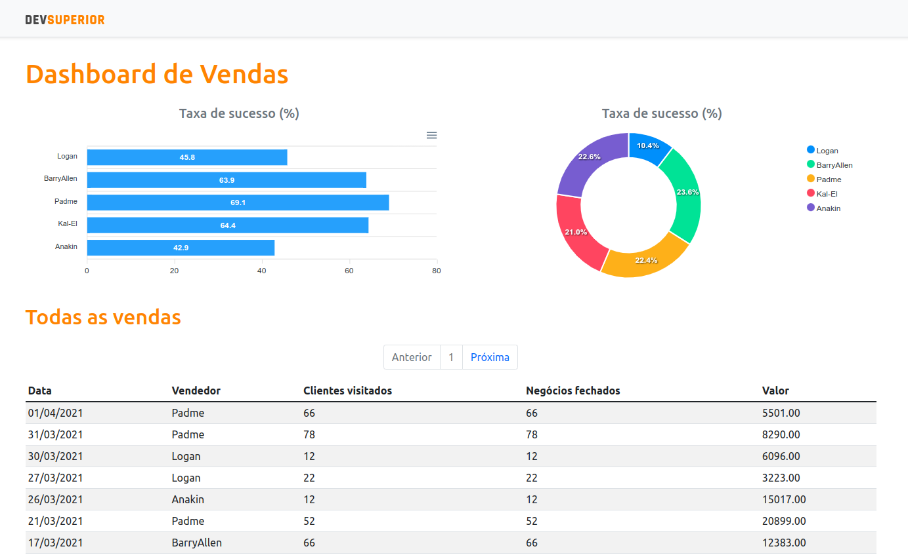

# Semana Spring React

Imersão voltada para desenvolvimento de uma aplicação utilizando as tecnologias [Spring Framework](https://spring.io/) e [React](https://pt-br.reactjs.org/), ministrado pela [DevSuperior](https://devsuperior.com.br/).

## Introdução

Esta é uma aplicação que apresenta um *Dashboard* de vendas fictícias.

## Tecnologias

### Backend

- Java
- Maven
- Spring Framework
- PostgreSQL
- pgAdmin

### Frontend

- React
- npm
- TypeScript

## [Certificado](https://learn.devsuperior.com/certificados/1830834)
